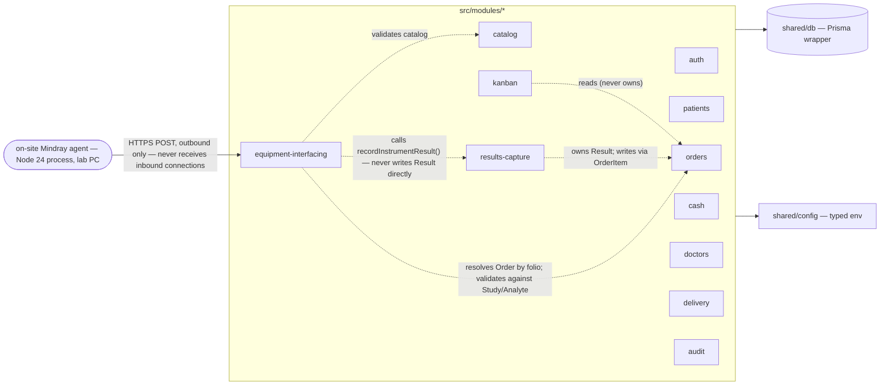
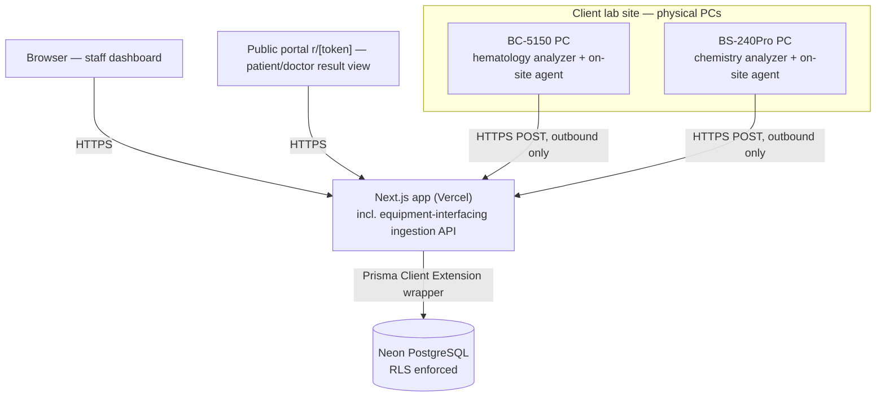
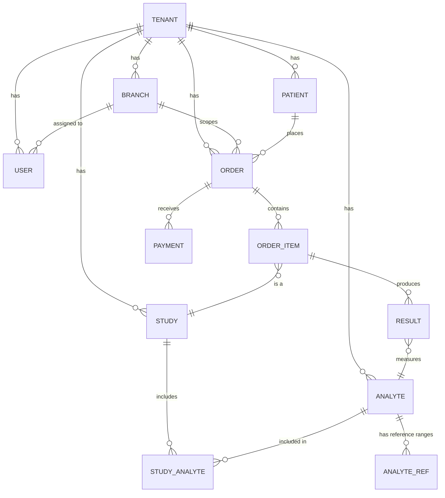

# Architecture Spine — Quimia IO

## Design Paradigm

**Screaming / vertical-slice modular monolith.** Domain modules are top-level vertical slices under `src/modules/*` — each owns its routes, server actions, and domain logic end to end (patients, orders, catalog, results-capture, equipment-interfacing, cash, doctors, delivery, audit, kanban). Chosen over full hexagonal (too much ceremony for a 17-week fixed-budget solo/AI-assisted build) and a simple layered architecture (no boundary discipline — exactly the divergence risk this spine exists to prevent).

Cross-module access always goes through an explicit interface/service call; a module never reads or writes another module's Prisma models directly. See AD-1 and the dependency diagram below.

## Invariants & Rules

### AD-1 — Design paradigm: Screaming / vertical-slice modular monolith `[ADOPTED]`

- **Binds:** all modules
- **Prevents:** ad-hoc layering, and a module reaching directly into another module's data instead of going through its interface
- **Rule:** every domain module is a top-level vertical slice under `src/modules/<name>/`, owning its own routes/server-actions/domain logic. Cross-module access happens only through an explicit interface/service call — direct reads or writes into another module's Prisma models are forbidden (e.g. `kanban` reads order state through the `orders` module's interface, never by querying `Order` itself).

### AD-2 — PostgreSQL host: Neon (not Supabase) `[ADOPTED]`

- **Binds:** all (data infrastructure)
- **Prevents:** assuming Supabase's built-in RLS/`auth.uid()` ergonomics apply
- **Rule:** PostgreSQL is hosted on Neon. Row-level security policies must not assume Supabase Auth session variables — the app is on Better Auth (AD-8), so RLS reads tenant context via `current_setting()`, set explicitly by the wrapper in AD-3. Every tenant-owned table has `FORCE ROW LEVEL SECURITY` set — without it, Postgres lets the connecting role's table *owner* bypass RLS entirely, which would silently void NFR-1 if the app ever connects as the owning/migration role. The app connects as a separate, non-owner role with only the grants its RLS policies actually need; a distinct migration role (never used by the running app) owns the schema. Neon's copy-on-write branching backs the per-module SPEC→SCHEMA dev flow and the preview-environment topology (AD-9).
- **Threat-model addendum (2026-08-02, decided during SDD proposal for Story 1.1):** Better Auth's own tables (`session`, `account`, `verification`) are **deliberately exempt from RLS** — Better Auth reads them by token, before any tenant context exists, which is neither scoped mode nor one of AD-3's three named bootstrap flows. This is a considered exemption, not a silent gap: the session token itself is the capability that gates access (an attacker without a valid token can't reach these tables meaningfully regardless of RLS), and every row these tables produce still resolves to a `tenantId`-scoped `User` before any tenant data is touched — RLS on `User` and everything else remains the actual isolation boundary. Do not add RLS policies to Better Auth's own tables expecting them to enforce tenant isolation; that isolation happens one hop later, at the `User`/application-data layer.
  - **`session`/`verification`:** justification is clean — gated by an unguessable bearer token.
  - **`account`** (holds the password hash, keyed by `userId` not by token): the same justification is weaker here, since it's reached by ID rather than capability-token. **Explicitly accepted as Phase 1 risk (2026-08-02, product owner decision, via SDD design for Story 1.1):** residual exposure requires the app's own DB role to already be compromised, and the exposed value is a hash, not a plaintext credential — accepted rather than adding a per-`userId` RLS policy to this one table. Revisit in Phase 2 if the threat model changes (e.g., multiple tenants sharing infra at a scale where this matters more).

### AD-3 — Database access: single Prisma client wrapper enforces tenant context `[ADOPTED]`

- **Binds:** all modules, NFR-1
- **Prevents:** a module (human- or AI-agent-built) silently bypassing tenant isolation via a raw Prisma call — including via a second, ad-hoc "unscoped client" invented for whichever flow doesn't yet have a session
- **Rule:** the only path to the database is one Prisma Client Extension wrapper (`src/shared/db`), with exactly two entry modes, never a third invented per-module:
  1. **Scoped mode** (the default, used by every authenticated request) — opens a transaction and runs `SET LOCAL app.tenant_id` / `app.role` from the authenticated session before any query; Postgres RLS policies read those via `current_setting()`.
  2. **Bootstrap mode** (used only to *resolve* a tenant before a session/scoped context can exist) — a narrowly-scoped, explicitly-named lookup against exactly one of: the tenant-subdomain lookup at login (`{lab}.quimiaio.com` resolves to a `tenantId` before Better Auth's session exists), the portal-token lookup (`quimiaio.com/r/{token}` resolves `tenantId` from the token itself — the portal is deliberately outside the tenant shell, per `EXPERIENCE.md.Foundation`), or the instrument API-key lookup (AD-7's HMAC-signed request resolves `tenantId` from the key before AD-6's scoped write). Each bootstrap lookup reads from an RLS-exempt table (`ApiKey`, or a tenant-resolution view) scoped to exactly the columns needed to resolve `tenantId` — never a general unscoped query — and its result immediately opens a **scoped** transaction (mode 1) for everything after.
  Direct `prisma.<model>` calls outside this wrapper, in either mode, are forbidden.

### AD-4 — Core schema ratified, with four corrections `[ADOPTED]`

- **Binds:** FR-22, FR-35, NFR-1, NFR-7, all data-owning modules
- **Prevents:** each module re-deriving a divergent base ERD; the capture UI conflating manually typed results with instrument-fed ones; `orders`/`kanban`/`results-capture` each inventing a different representation of pipeline state; a correction overwriting history instead of being logged
- **Rule:** the owner's draft schema (`quimiaio-prompt-maestro.md` §9 — Tenant, User, Patient, Order, OrderItem, Study, Analyte, AnalyteRef, Result, Payment, StudyAnalyte) is the base ERD, with four binding corrections:
  1. `Order.folio` carries a composite unique index on `(tenantId, folio)`, not a global unique constraint, matching the client's real daily-reset folio — confirmed from the client's own label photos reviewed during this coaching session (not stated in PRD FR-22, which only says "unique per-tenant folio"); the composite index stays collision-safe across days because the date is already embedded in the folio string itself, so two different days never produce the same `(tenantId, folio)` pair.
  2. `Result` gains a `source` enum (`MANUAL` | `INSTRUMENT`) so the capture screen can visually distinguish auto-populated analytes from manually typed ones.
  3. `OrderItem.status` (`ItemStatus`: `recepcion` | `muestra_recibida` | `en_analisis` | `validado` | `entregado` | `cancelado`) is a **stored** field, not purely derived — `EXPERIENCE.md.State Patterns` already fixed these six values (five pipeline states + cancelled) and the rule that a `Kanban` card's column is the *least-advanced* `OrderItem.status` across the order's items, recomputed whenever any item's status changes. A purely-derived (compute-on-read, no stored column) representation cannot support the same spec's correction-only manual Kanban drag, which must persist as an explicit, audit-logged status write — so status is always a write, whether system-triggered (the normal path) or a manual override (the correction path); both go through the same write, distinguished only by an audit-log entry noting which one it was.
  4. A `Result` row is **mutable** (an `UPDATE`, not an append-only insert) — but every mutation, including a post-validation correction, is written in the *same transaction* as a paired `AuditLog`/correction-history entry capturing `who`/`when`/`before`/`after` (`EXPERIENCE.md.State Patterns`, "Correction/change history"). The Prisma wrapper (AD-3) exposes this as one call (e.g. `updateResult()`) that always writes both rows together — a module can never write one without the other. AD-10's immutability guarantee applies to `AuditLog` itself, not to `Result`.

### AD-5 — Equipment interfacing runs as an on-site agent process, never a cloud-held device connection

- **Binds:** FR-74a
- **Prevents:** assuming Vercel/cloud can hold a persistent device connection; assuming new client-site hardware is needed
- **Rule:** each interfaced instrument (BC-5150, BS-240Pro) gets its own lightweight on-site Node 24 agent process, installed on the same PC already dedicated to that instrument (the client's existing one-PC-per-analyzer topology; no new hardware). The agent listens to the instrument's native host interface (HL7/ASTM over local TCP or serial) and pushes results to the cloud app via an authenticated outbound HTTPS call to the ingestion API. The Vercel-hosted app is never the one holding or opening a connection to lab-site hardware.

### AD-6 — Order/analyte matching key: `Order.folio`, no separate Sample/Container entity

- **Binds:** FR-74a, FR-22
- **Prevents:** inventing a per-tube Sample/Container identity model the client's real workflow doesn't have (the barcode is identical across every tube of one order; tube color is a phlebotomy draw-guide only, not instrument-read); `equipment-interfacing` inventing its own `Result` write path instead of going through the one AD-1 already mandates
- **Rule:** an incoming instrument result carries `{folio, analyte_code, value}`. The `equipment-interfacing` module resolves the `Order` by `(tenantId from the instrument's API key, folio)` and validates that the analyte belongs to a `Study` the order actually requested — but it does **not** write `Result` itself. `results-capture` is `Result`'s sole owner (AD-1): it exposes an interface (e.g. `recordInstrumentResult(orderItemId, analyteId, value)`) that `equipment-interfacing` calls, exactly like any other cross-module access. That interface writes one `Result` row per `(orderItemId, analyteId)` pair (`@@unique` on that pair, upsert semantics) — never a batch replace of "all results in this study" — so a concurrent instrument post and a manual keystroke on a *different* analyte in the same study never collide; the one path is `source = INSTRUMENT` (AD-4). The same order may mix instrument-sourced and manually captured analytes — other lab equipment (e.g. Finecare Wondfo, microscope) stays manual by design — so the results-capture screen must support both concurrently within one order, and within one study (see EXPERIENCE.md Flow 2: the instrument may not report every analyte in its own panel).

### AD-7 — Local-agent-to-cloud authentication: per-instrument API key + HMAC signing `[ADOPTED]`

- **Binds:** the FR-74a ingestion endpoint
- **Prevents:** replay attacks and key-in-plaintext exposure, without requiring certificate management on an unmanaged lab PC
- **Rule:** each on-site agent authenticates with a per-instrument API key plus HMAC request signing over body + timestamp. Bare bearer tokens and mTLS are not used for this endpoint.

### AD-8 — Auth provider: Better Auth (not NextAuth v5) `[ADOPTED]`

- **Binds:** the `auth` module; all modules that perform session/role checks; NFR-2
- **Prevents:** building new session/role logic on Auth.js v5, which its own maintainers have placed in maintenance mode and redirect new projects away from; each module enforcing its own (possibly inconsistent) password rule
- **Rule:** authentication and session management use Better Auth exclusively. Better Auth's password policy is configured once, centrally, to satisfy NFR-2's complexity mandate — no module re-implements or re-checks password rules of its own.
- **Multi-tenant email uniqueness override (2026-08-02, decided during SDD proposal for Story 1.1):** Better Auth's default `User` model assumes email is globally unique — incompatible with multi-tenancy (two different labs onboarding a user with the same email address is a real, expected case, not an edge case). Override Better Auth's default constraint: uniqueness is `(tenantId, email)` and `(tenantId, nickname)`, never a bare global-`email` unique index. Configure this at the Prisma schema level before Better Auth's adapter is wired — retrofitting it after data exists means a manual dedup migration.

### AD-9 — Deployment & environments topology `[ADOPTED]`

- **Binds:** all (operational envelope)
- **Prevents:** exercising equipment-interfacing code against real hardware outside production; agent API keys leaking into source control
- **Rule:** `dev (local)` → `preview (Vercel preview deploy + ephemeral Neon branch per PR)` → `production (Vercel production deployment + Neon main branch)`. The on-site equipment-interfacing agents run **only** in production, on the client's lab PCs; dev and preview use simulated HL7/ASTM messages, never real hardware. Each agent's API key lives in a local config file on its lab PC, never in source control; server-side secrets live in Vercel/Neon environment variables.
- **Test-time database (2026-08-02, decided during SDD proposal for Story 1.1):** RLS behavior cannot be verified against a mocked Prisma client — a mock proves the mock works, not that Postgres enforces the policy. Every test run that touches the wrapper or RLS (this project runs Strict TDD, so that's most of them) gets its own ephemeral Neon branch, the same mechanism already adopted for PR previews — no new infrastructure (e.g. local Docker Postgres) introduced solely for testing.

### AD-10 — Audit-log write path is single and immutable `[ADOPTED]`

- **Binds:** all modules, NFR-7, FR-52
- **Prevents:** a module writing audit entries through a different path than another module; an admin (or a bug) silently editing or deleting audit history
- **Rule:** every `AuditLog` write goes through the same Prisma wrapper entrypoint already mandated by AD-3 — no module opens its own audit-write path. The database role the app connects as holds no `UPDATE`/`DELETE` grant on `AuditLog`; immutability is enforced at the Postgres privilege level, not by application discipline alone. This only holds if the app role is *not* `AuditLog`'s owner — a table owner implicitly bypasses its own grants/revokes in Postgres, so AD-2's role separation (app role ≠ migration/owning role) is this AD's precondition, not an independent detail. `AuditLog`'s minimum required shape — `id`, `tenantId`, `entity`, `entityId`, `action`, `before` (json, nullable), `after` (json), `actorUserId`, `createdAt` — is fixed here because it's cross-cutting (every module writes it); anything beyond that (admin filtering UI, retention/export tooling) stays deferred to `audit`'s own SPEC→SCHEMA time.

### AD-11 — Kanban/dashboard real-time updates: client-side polling, not WebSocket/SSE `[ADOPTED]`

- **Binds:** `results-capture`/`kanban` live views, NFR-5
- **Prevents:** one module building a persistent-connection channel (WebSocket/SSE) while another polls, splitting the real-time story across two mechanisms and requiring sticky-connection infra that doesn't fit Vercel's serverless model or the solo-dev operational constraint
- **Rule:** the Kanban board and dashboard live views refresh via SWR (Stack) polling every 4 seconds — one interval, inside the NFR-5 SLA window, defined once in a shared `shared/` hook and consumed by both `kanban` and `results-capture`'s dashboard view, never reimplemented per module. No module introduces a persistent server-push connection in Phase 1.

### AD-12 — Backup/restore: Neon's built-in continuous backup, not a custom job `[ADOPTED]`

- **Binds:** `shared/db`, NFR-8
- **Prevents:** a module or agent assuming a bespoke backup system needs to be written
- **Rule:** Phase 1 relies on Neon's built-in continuous backup / point-in-time restore (the same Neon capability already adopted for branching, AD-2) to satisfy NFR-8's operational-recovery half — a documented quarterly restore-drill is a Phase 1 operational task, not a system to build. **Not covered here:** Neon's PITR window is days-to-weeks, not the multi-year retention NOM-007/NOM-024 may require for clinical records — whether that's a real Phase 1 obligation, and what long-term archival mechanism it needs, is an open question flagged for the user (see the note this Finalize session raised alongside file/object storage and observability).

### Dependency direction



## Consistency Conventions

| Concern | Convention |
| --- | --- |
| Naming (entities, files, interfaces, events) | Prisma models: PascalCase singular. Fields: camelCase. API routes: kebab-case. Domain events: `module.action` (e.g. `orders.result-received`). |
| Data & formats (ids, dates, error shapes, envelopes) | IDs: cuid2. Dates: ISO-8601 UTC in the database; localize to Mexico time only at the presentation layer. API errors: single envelope `{ error: { code, message, details? } }` across all modules. |
| State & cross-cutting (mutation, errors, logging, config, auth) | All mutations go through the Prisma wrapper (AD-3). Structured JSON logging carries `tenant_id` and `request_id` on every line. Zod validates both typed environment config (no raw `process.env` reads in business logic) and every API request/response payload — no unvalidated input crosses a module boundary. |

## Stack

| Name | Version | Notes |
| --- | --- | --- |
| Next.js (App Router) | `>=16.2.11` | Phase 1 — verified via web (2026-07-30): 16.2.0–16.2.10 are unpatched against 9 CVEs disclosed 2026-07-20, incl. CVE-2026-64642 (App Router + Turbopack + single `config.i18n.locales` entry → middleware/proxy bypass, i.e. auth checks skipped — directly relevant, Quimia IO is single-locale es-MX with middleware session/role gating). Never pin below `.11`. |
| TypeScript | `6.x`, strict mode | Phase 1 — verified via web (2026-07-30): TS 6.0 (JS-based, deprecation runway) shipped 2026-03-23; TS 7.0 (Go-native) went GA 2026-07-08 but Next.js support for 7 is canary-only behind an experimental flag — do **not** jump to 7 yet, it drops `lib/typescript.js` and breaks `next build`'s TS detection. |
| Tailwind CSS + shadcn/ui | v4 (defaults to Base UI over Radix) | Phase 1 |
| PostgreSQL | hosted on Neon, RLS enforced (`FORCE ROW LEVEL SECURITY`, see AD-3 amendment), pooled connection string (pgbouncer) for the serverless Vercel runtime | Phase 1 |
| Prisma | 7.x (Rust-free, TS-native runtime) + Client Extension wrapper | Phase 1 — setup differs from Prisma 5/6: `prisma.config.ts` replaces the datasource `url`, `@prisma/adapter-pg` and generator `output` are now required, env vars no longer auto-load. Verify the exact Better Auth + `adapter-pg` combo against Prisma's own issue tracker before wiring auth — a live P1010 report exists for that pairing as of this check. |
| Better Auth | current | Phase 1 |
| `@react-pdf/renderer` | `4.5.1` (diegomura) | Phase 1 — tickets, work orders, container labels. **Not** `react-pdf` (wojtekmaj) — that package is a PDF *viewer*, not a generator; wrong pick for this row's job. |
| Resend | unpinned | Phase 1 — email |
| qrcode.react | unpinned — **caution** | Phase 1 — patient-portal QR. Verified via web (2026-07-30): last release 4.2.0 (~2 years old), Snyk flags it as possibly discontinued, no stated React 19 support. Re-verify (or shortlist a replacement) before patient-portal work starts; not a Phase 1 blocker today. |
| SWR | current | Phase 1 — single shared polling hook behind AD-11; both Kanban and dashboard consume it, not two independent implementations. |
| Serwist (`@serwist/next`) | current | Phase 1 — PWA/service-worker (NFR-6); `next-pwa` is archived/unmaintained, Serwist is its actively-maintained successor |
| Vercel | — | Phase 1 host for the Next.js app |
| Node.js | 24 LTS | Phase 1 — on-site equipment-interfacing agent runtime, per-instrument PC. Node 24's LTS window ends 2026-10-28 — check before that date whether a successor LTS pin is needed for the agent runtime. |
| Twilio (WhatsApp) | unpinned | **Phase 2 only** |
| Stripe | unpinned | **Phase 2 only** |
| VPS / Railway | — | **Phase 2 only** — rehost target once off Vercel |

## Structural Seed

### System / container view



Neither analyzer PC ever receives an inbound connection from the app — both agents call out; the app never calls in.

### Deployment & environments

| Environment | Compute | Database | Equipment agents |
| --- | --- | --- | --- |
| dev (local) | local Next.js dev server | local/dev Neon branch | not connected — simulated HL7/ASTM messages only |
| preview | Vercel preview deploy per PR | ephemeral Neon branch per PR | not connected — simulated messages only |
| production | Vercel production deployment | Neon main branch | both on-site agents live, running on the client's lab PCs |

Governed by AD-9.

### Core-entity ERD



- `Order.folio` — composite unique on `(tenantId, folio)`, not globally unique (AD-4, AD-6).
- `Result.source` — enum `MANUAL | INSTRUMENT` (AD-4), read by the capture screen (FR-35).
- `OrderItem.status` — enum `ItemStatus`, stored, six values (AD-4 correction 3); `Kanban` column = least-advanced value across an order's items.
- `Study` needs a `tubeType`/`tubeColor` catalog attribute (e.g. amarillo/lila/rojo) to drive how many container labels print per order and in which color (FR-22) — catalog data, not a new entity.
- **`Branch` is Phase 1, not Phase 2** — reversing this spine's earlier Deferred call. `Caja`'s per-branch cash session (`CashSession`) is already a Phase 1 FR (FR-46), and modeling `branchId` on `Order`/`User`/`CashSession` from day one avoids a Phase-2 migration that would otherwise hit `orders` (needed ~week 5) before `cash` (needed ~week 13). Phase 1 seeds exactly one `Branch` row per tenant automatically at signup; Phase 2's Red plan (multi-branch, branch switcher) is additive — more rows, no schema change. Full `Branch` model detail (address, hours, etc. beyond the FK) stays deferred to `catalog`'s own SPEC→SCHEMA time.

### Source tree

```text
src/
  modules/
    auth/                    # login, session, role checks
    patients/
    orders/                  # folio, OrderItem, Payment; owns Order data
    catalog/                 # Study, Analyte, AnalyteRef, StudyAnalyte
    results-capture/         # capture + validation UI/logic
    equipment-interfacing/   # HTTP ingestion API, folio/analyte matching
    cash/                    # Caja
    doctors/
    delivery/
    audit/
    kanban/                  # reads orders, does not own order data
  shared/
    db/                      # Prisma Client Extension wrapper (RLS context)
    config/                  # typed env (Zod)
agents/
  mindray-agent/             # separate Node 24 process, one per instrument, runs on the client's lab PC
```

Supersedes `quimiaio-prompt-maestro.md` §10's flat file-structure sketch — that section is named in this spine's own `sources:`, but AD-1's vertical-slice tree above is the binding one, logged here explicitly rather than left as a silent divergence.

## Capability → Architecture Map

| Capability / Area | Lives in | Governed by |
| --- | --- | --- |
| FR-74a — live unidirectional equipment interfacing | `agents/mindray-agent` (external process) + `src/modules/equipment-interfacing` | AD-5, AD-6, AD-7 |
| FR-74b — generalized / bidirectional equipment interfacing | not built in Phase 1 | Deferred |
| FR-22 — order save prints container labels, payment ticket, work order | `src/modules/orders`, `src/modules/catalog` (tube type/color) | AD-6, AD-4 |
| FR-35 — capture list distinguishes auto-populated vs. manual analytes | `src/modules/results-capture` | AD-4 |
| NFR-1 — tenant isolation | `src/shared/db`, all modules | AD-2, AD-3 |
| NFR-5 — Kanban/dashboard real-time SLA | `src/modules/kanban`, `src/modules/results-capture` | AD-11 |
| NFR-6 — PWA/offline floor | app shell (`src/app`) | Stack (Serwist) |
| NFR-7 — audit-log immutability | `src/modules/audit`, `src/shared/db` | AD-10 |
| NFR-8 — backup/restore | `src/shared/db` (Neon) | AD-12 |

## Deferred

- **Doctor, CashSession/Caja, AuditLog, User.roleId/Role models.** Needed for Phase 1 FRs (the last for FR-3/NFR-2's RBAC, Usuarios y Roles) but not yet drafted in the owner's schema sketch. Deferred to each module's own SPEC→SCHEMA authoring time (per the mandated per-module dev flow), not decided upfront in this spine.
- **`Study`'s dangling catalog FKs** (`sampleTypeId`, `methodId`, `techniqueId`, `equipmentId` — `quimiaio-prompt-maestro.md` §9). Same treatment as the already-resolved `containerId` gap and the Doctor/CashSession/AuditLog models above: real catalog references the owner's sketch names but doesn't fully draft, resolved at each module's own SPEC→SCHEMA time.
- **Company, Quotation, Inventory, CFDI models.** Phase 2 scope (Plan RED / CFDI add-on) — no Phase 1 architectural decision needed.
- **Altitude engine.** Phase 2 SaaS differentiator per `addendum.md`'s deferred-considerations list — no Phase 1 architectural footprint.
- **Observability/error-tracking.** Structured JSON logging (Consistency Conventions) covers log-level visibility, but no APM/error-tracking tool is named — a working default of Vercel's own built-in logs/observability for Phase 1, with Sentry (or equivalent) added only if that proves insufficient once real traffic exists, rather than adding a dependency upfront. Revisit if the solo-dev operator finds Vercel's native visibility isn't enough to catch an on-site agent going silent.
- **Neon free-tier branch cap vs. branch-per-PR (AD-9).** Neon's free tier caps concurrent branches (historically ~10); a branch-per-PR preview strategy at any real PR velocity could hit that cap. Not a Phase 1 blocker (solo-dev, low PR concurrency) but worth a plan-tier check before PR volume grows.
- **FR-74b — generalized/bidirectional equipment interfacing.** Phase 2 per `sprint-change-proposal-2026-07-27`; CSV/HL7 batch fallback, per-brand driver onboarding, and host-query (bidirectional) mode are all designed only if and when a specific client's workflow requires it.
- **BS-240Pro's exact protocol and transport.** `addendum.md` flags this as unconfirmed: Mindray's chemistry-line host-interface manuals cover both HL7 v2.3.1 and ASTM E1394-97, over TCP/IP or RS-232 serial depending on model/configuration. Must be confirmed against the client's actual BS-240Pro host-interface manual (or by contacting Mindray) before driver work starts for that instrument — a real open item, not resolved in this coaching session. (BC-5150's protocol, HL7 per Mindray's dedicated manual, is already confirmed.)
- **WhatsApp (Twilio) and Stripe integrations.** Phase 2, deferred with the rest of the Phase-2 stack.
- **ToronjaLab data migration.** Rejected for Phase 1 (greenfield start); preserved only as an optional paid service contingent on ToronjaLab's export formats (PRD open question OQ-3).
